# visualization.github.io
可视化大作业
### 各国人均耗电量与城镇人口占比关系演变

> 项目成员：
>
> 宋璎航、皮亚杰、邓松林、施养权

从上世纪60年代到现在，全球各个地区国家的人们平均生活质量都是由显著的提升的。我们组从统计的数据划分6个角度方面来分析各个数据可视化，和相互结合分析出各个的关系演变来实现对应可视化。

本项目，使用交互式仪表盘对各国人均耗电量与城镇人口占比关系演变数据进行可视化，用户可以进行交互式探索获取更多信息。本项目可以用于清晰的看出近几十年的变化程度和单独某年的数据详情及其对应占比比例等信息。

##### 数据集：

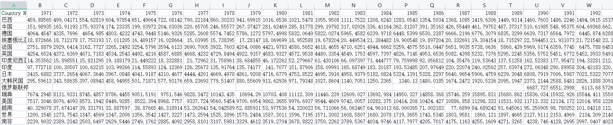

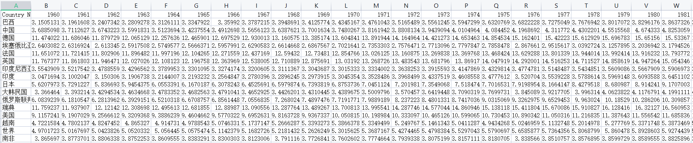

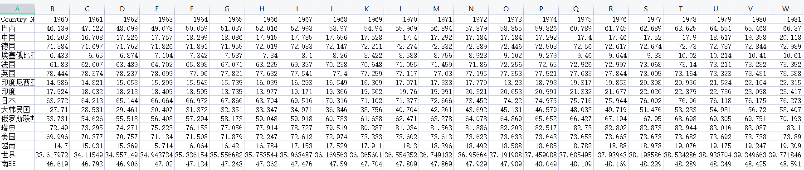

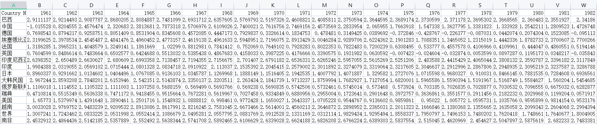

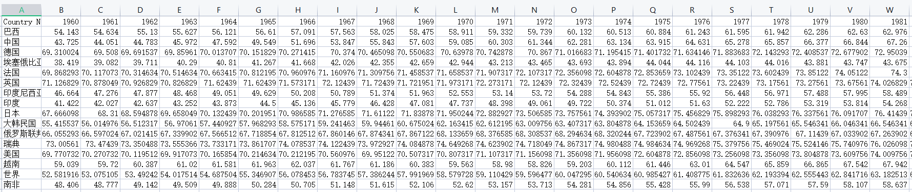

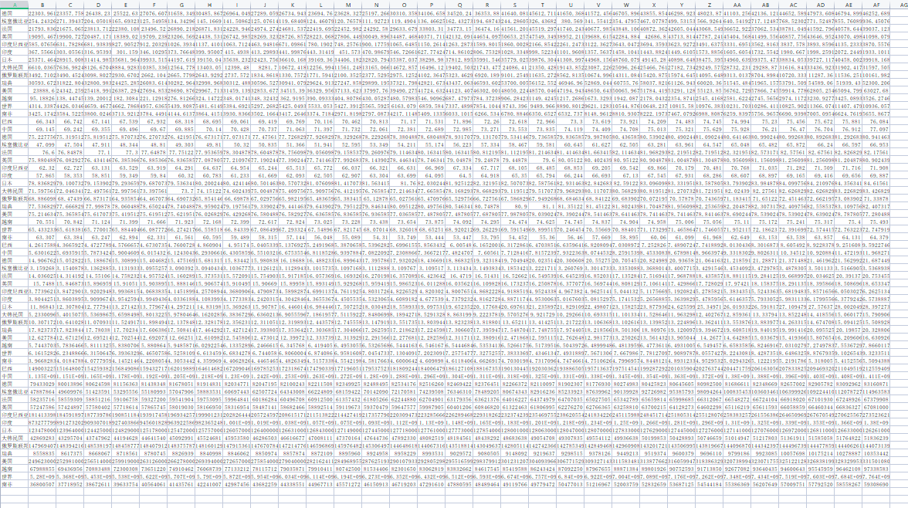

如上面七个图片所展示的是我们使用的近几十年大部分地区国家的人均耗电量、65岁以上人口占比、城镇人口占比、人口增长率、人均GDP、出生时预期寿命的相应数据。

数据中包括国家（列A）、对应年份（行1）、具体数据（列B~）。

##### 项目框架：

本项目使用html+js+css+echarts实现，整体有两个部分的功能实现：

###### line-race

可视化面板可以分为两个部分

- 左边部分显示表的是可以交互选择来将相对应的数据在右边部分显现出来。

- 右边部分由对应主题和相关数据的折线可视化，其中在折线末端可以看到现在的所对应的国家和详细的数据，也可以通过鼠标悬停放置来显示具体的年份和对应的数据。在左端和右端也有对应的drag tag功能。

- 如下图示

  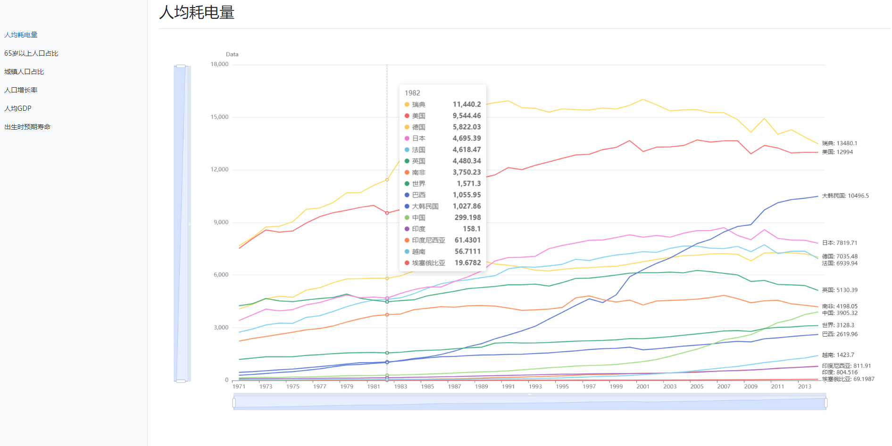

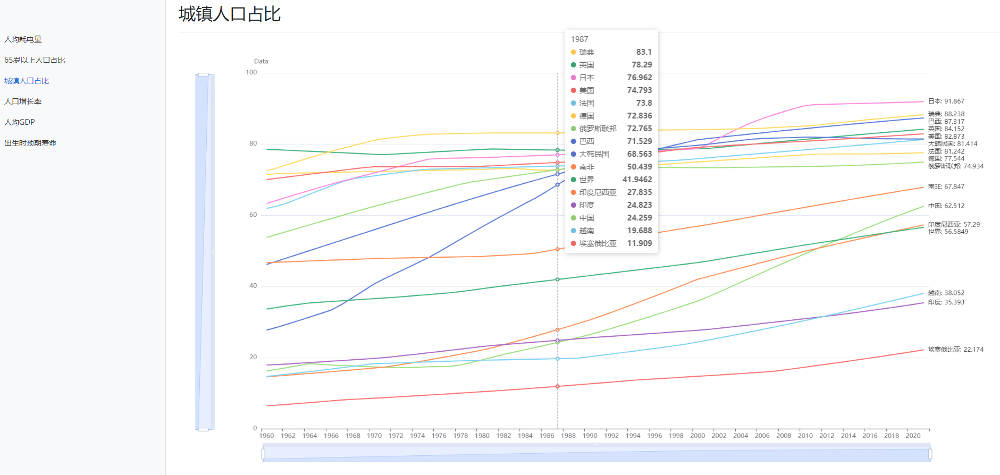

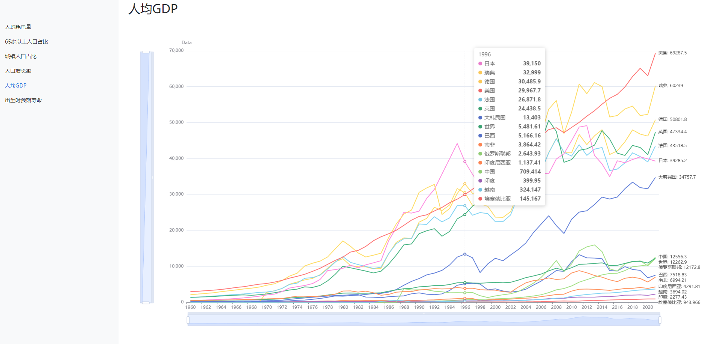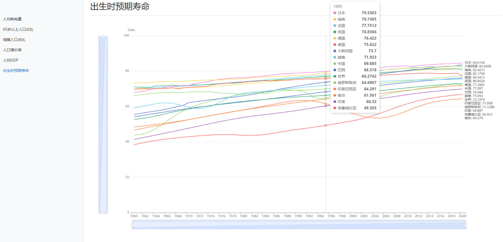

###### life-expectancy

这部分的可视化是选取的近30年，也就是1990-2020年的样本数据

- 右上角的横栏可以交互选择其中两个来使得更新对应的X、Y轴。右边的年份是自动增加的，也可以按下暂停或者拖动交互来对具体的某年分析。
- 可以通过对应的鼠标悬停来查看对应的地区国家的具体数据分析。

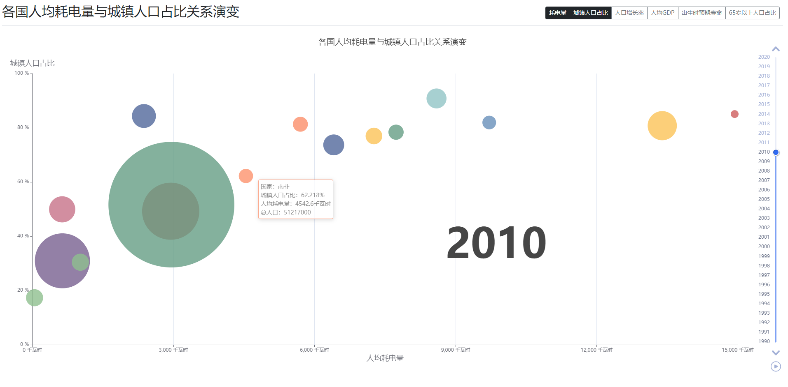

### 总结

从交互式面板中，我们可以了解到数据内容集里的以下信息：

- 人均耗电量中印度地区很低，而美国瑞典几乎是其的十几倍。

- 在近几年日本的老龄化凸显得十分严重。

- 在近20里，我国得城镇发展进步非常大

- 大部分国家地区的家庭不再像6、70年代那样平均3、4个孩子，在近几年平均只生一个孩子。

- 发达国家的人均GDP是越来越高，我国的人均GDP也在逐渐提高。

- 在出生时预期的寿命从6、70年代到如今已经平均提高了10年的预期寿命了。

  使用这个可视化面板，也是可以对其他更具体的问题进行探索和分析处理的。
